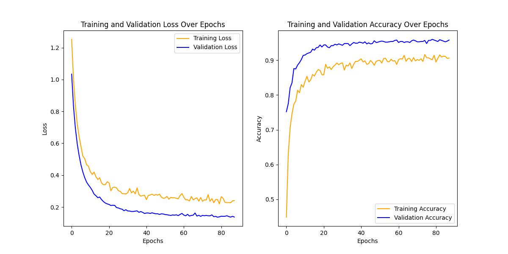
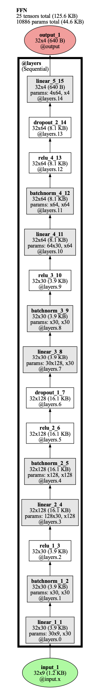

# AirQNet (Air Quality Network)

**AirQNet** is a full **end-to-end** PyTorch-based project for **air quality classification**—covering data ingestion, preprocessing, model training, evaluation, and inference. This repository demonstrates the entire AI modeling pipeline using the [Air Quality and Pollution Assessment dataset](https://www.kaggle.com/datasets/mujtabamatin/air-quality-and-pollution-assessment).

- **Model Size**: 10,886 parameters
- **Accuracy**: ~93% on the test set
- **Framework**: PyTorch with additional libraries like NumPy, Pandas, and scikit-learn
- **Key Features**:
  - Data loading and **feature normalization** 
  - **Feedforward neural network** (`FFN`) with BatchNorm and Dropout
  - **Cross-entropy** loss for multi-class classification
  - **AdamW optimizer** with weight decay
  - **Early stopping** and automatic **checkpointing** 
  - **Live plotting** of loss and accuracy during training
  - **Inference script** for single and bulk prediction 

----

## Datasets

- [Air Quality and Pollution Assessment](https://www.kaggle.com/datasets/mujtabamatin/air-quality-and-pollution-assessment)
- The repository includes scripts to split and preprocess the CSV data. 

----

## Training and Evaluation

1. **Training Script** (`main.py`)
   - Loads the dataset via `train_loader` / `val_loader`.
   - Initializes the model `FFN`, optimizer, and hyperparameters.
   - Implements **early stopping** to halt training when validation loss stops improving.
   - **Visualizes** training & validation metrics in real time.

2. **Evaluation Script** (`evaluation.py`)
   - Loads the trained model from a `.pth` file.
   - Computes accuracy and class probabilities on a test set.
   - Provides utility to predict individual samples or entire CSV files.
   - Exports predicted classes and probabilities to a CSV.

----
## Results

**Plots**



----

**Model Computational Graph ([torchlens](https://github.com/johnmarktaylor91/torchlens))**


----

## Usage

1. **Install Dependencies**  
   ```bash
   pip install -r requirements.txt
2. **Train the Model**
   ```bash
   python main.py
3. **Evaluate / Predict**  
   ```bash
   python evaluation.py
